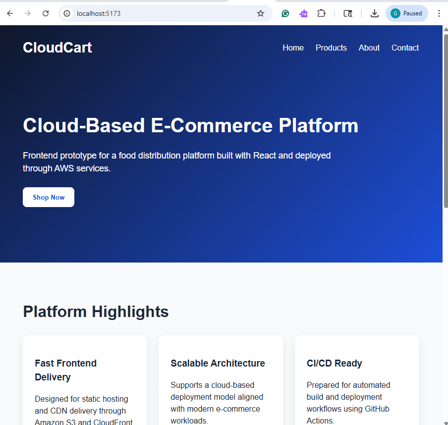
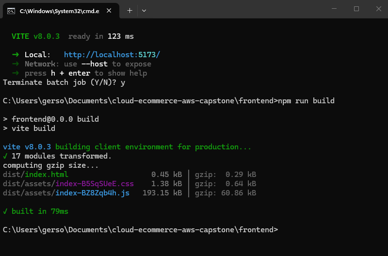
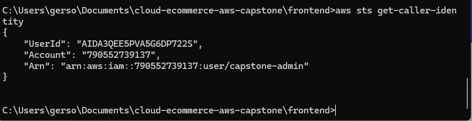
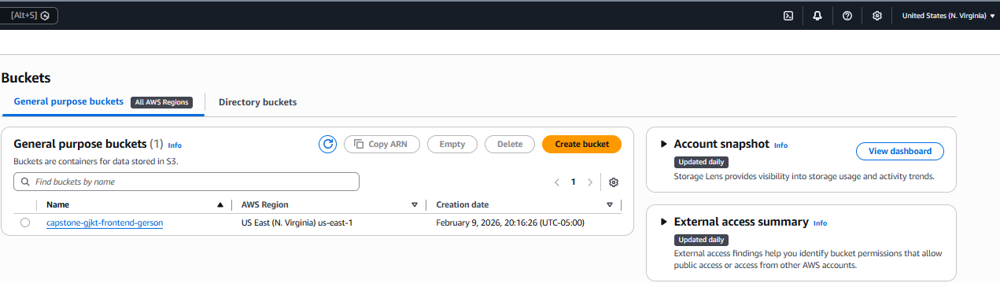
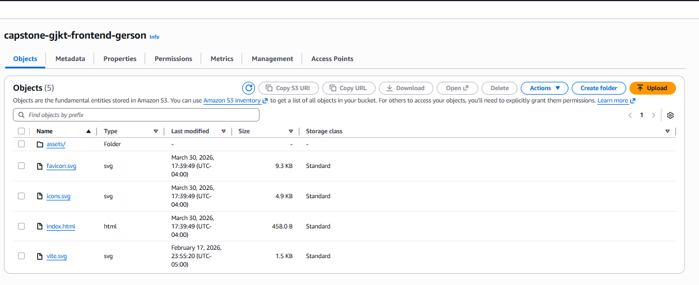
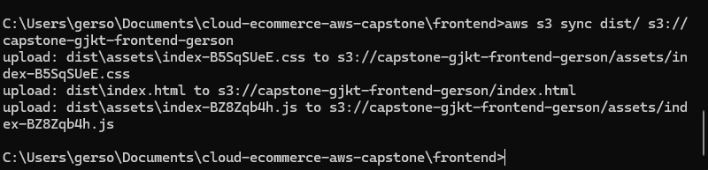
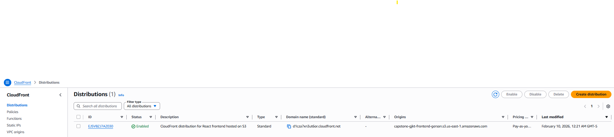
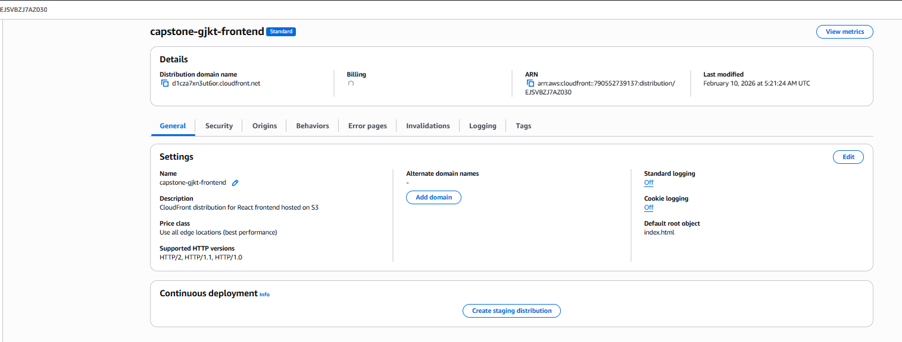
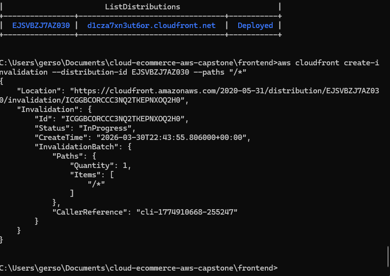
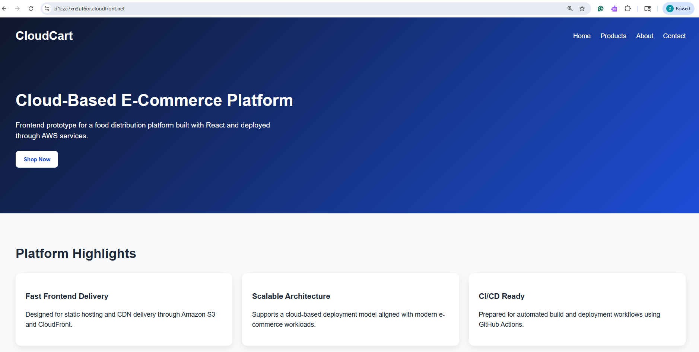

# CloudCart – Cloud-Based E-Commerce Frontend

## 🌐 Live Application

http://d1cza7xn3ut6or.cloudfront.net/

---

## 📌 Project Overview

CloudCart is a cloud-based e-commerce frontend prototype designed for a food distribution platform. The application was developed using React and deployed using AWS services, demonstrating a scalable and cost-efficient cloud architecture.

This project showcases static website hosting using Amazon S3 combined with global content delivery through Amazon CloudFront.

---

## 🏗️ Architecture Overview

* **Frontend Framework:** React (Vite)
* **Hosting:** Amazon S3 (Static Website Hosting)
* **CDN:** Amazon CloudFront
* **Deployment Method:** AWS CLI
* **CI/CD Ready:** GitHub Actions (prepared)

---

## ⚙️ Key Features

* Responsive React frontend UI
* Static hosting via Amazon S3
* Global CDN delivery with CloudFront
* Secure and optimized content distribution
* Production-ready build using Vite

---

## 🚀 Deployment Process

### 1. Build the application

```bash
npm run build
```

### 2. Upload files to S3

```bash
aws s3 sync dist/ s3://capstone-gjkt-frontend-gerson
```

### 3. Invalidate CloudFront cache

```bash
aws cloudfront create-invalidation --distribution-id EJSVBZJ7AZO30 --paths "/*"
```

---

## 📸 Deployment Evidence

### 🔹 Local Development



### 🔹 Production Build



### 🔹 AWS CLI Authentication



### 🔹 S3 Bucket



### 🔹 S3 Deployment Files



### 🔹 Deployment via AWS CLI



### 🔹 CloudFront Distribution



### 🔹 CloudFront Configuration



### 🔹 Cache Invalidation



### 🔹 Live Application



---

## 🔐 Security Considerations

* IAM user-based authentication (no root access used)
* AWS credentials are securely managed and not exposed
* CloudFront configured with restricted S3 access
* HTTPS delivery via CloudFront

---

## 📊 Scalability & Performance

* CloudFront provides low-latency global content delivery
* Edge caching improves load times
* S3 ensures high durability and availability
* Architecture supports scaling for increased traffic

---

## ✅ CI/CD Pipeline Verified

A change pushed to the application code automatically:

- Triggered a GitHub Actions workflow
- Built the React application
- Deployed updated files to Amazon S3
- Invalidated CloudFront cache

The update was reflected live without manual deployment, demonstrating a fully functional CI/CD pipeline.

## 💡 Future Enhancements

* Backend integration (API Gateway + Lambda or ECS)
* Database integration (RDS or DynamoDB)
* User authentication (Amazon Cognito)
* CI/CD pipeline improvements (multi-environment deployments, testing stages)

---

## 👨‍💻 Author

**Gerson Rezende**
Bachelor of Science in Cloud Computing and Solutions
Purdue University Global

---

## 📎 Notes

This project was developed as part of a capstone assignment to demonstrate cloud architecture, deployment automation, and frontend hosting using AWS services.

